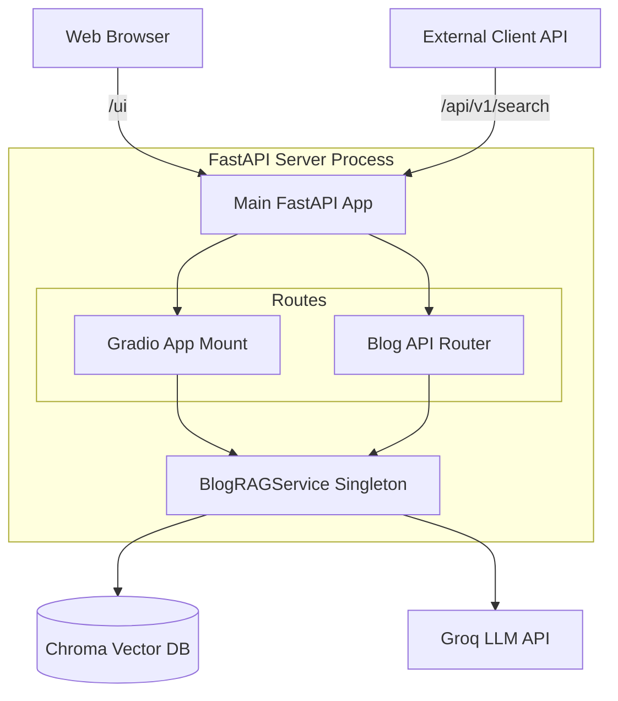

# blog-rag

## Run

### Settings
- uv env
```
uv sync --link-mode=copy
```

- .env
```
GROQ_API_KEY=
```

- Vector DB Save
  - naver-blog-md: naver blog to markdown
    - [collector/README.md](collector/README.md)
```
poetry run crawl.py
```

### Vector DB Query
- Vector DB Query
```
uv run vector_query.py

========================================
[*]  RAG Test CLI
[*]  Blog Data Dir : ...\blog-rag\data\blog_posts
[*]  Vector DB Dir : ...\blog-rag\data\chroma_db
========================================
```
- 질문 테스트
```
Q: RSS가 뭐야?

A: RSS(Rich Site Summary)는 웹 사이트의 콘텐츠를 추출하고 다른 플랫폼에 제공하는一种 표준 포맷입니다. RSS는 XML 기반의 마크업 언어로, 웹 사이 트의 뉴스 피드, 블로그 포스트, 또는 다른 콘텐츠를 추출하고 다른 플랫폼 에 제공하는 데 사용됩니다.

RSS는 웹 사이트의 콘텐츠를 추출하고 구조화된 데이터로 제공하는 데 사용 됩니다. RSS는 XML 기반의 마크업 언어로, 웹 사이트의 뉴스 피드, 블로그  포스트, 또는 다른 콘텐츠를 추출하고 다른 플랫폼에 제공하는 데 사용됩니 다.

RSS는 다음과 같은 특징을 가지고 있습니다.

- 웹 사이트의 콘텐츠를 추출하고 구조화된 데이터로 제공합니다.
- XML 기반의 마크업 언어로 작성됩니다.
- 웹 사이트의 뉴스 피드, 블로그 포스트, 또는 다른 콘텐츠를 추출하고 다 른 플랫폼에 제공하는 데 사용됩니다.
RSS는 웹 개발자, 블로거, 또는 콘텐츠 제공자에게 유용한 도구입니다. RSS 를 사용하면 웹 사이트의 콘텐츠를 추출하고 다른 플랫폼에 제공하는 데 사 용할 수 있습니다.

**관련 키워드:** #RSS #XML #웹개발 #블로그 #콘텐츠제공

---
**[*] 참조된 문서:**
- [*] 2025-11-09-python-rss와-llm-api를-활용한-ai-자동화-파이프라인-구 성.md
--------------------
```

### FastAPI & Gradio
- API 서버와 UI 동시 실행
```
uv run main.py --mode all
uv run main.py
```

- API/ui만 실행
```
uv run main.py --mode api
uv run main.py --mode ui
```

- gradio share link 생성
```
uv run main.py --mode ui --share
gradio deploy
```

- 프로세스 강제 종료: ChromaDB 충돌 때문에 한 프로세스만 사용 가능
```
taskkill /F /IM uv.exe
taskkill /F /IM python.exe
```


## Architecure

