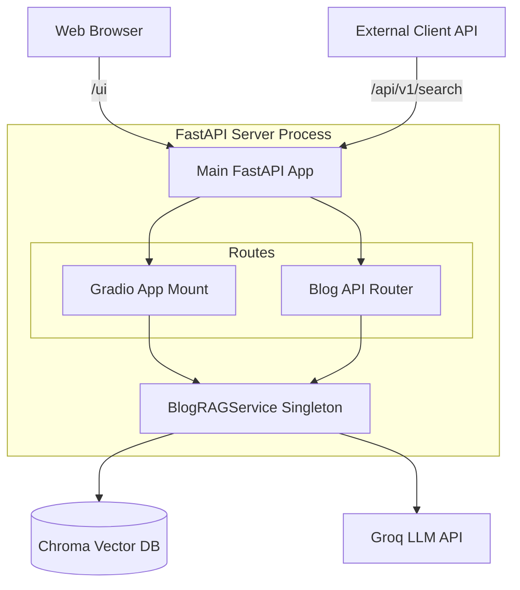

# blog-rag

## Run

### Settings
- uv env
```
uv sync --link-mode=copy
```

- .env
```
GROQ_API_KEY=
```

- Vector DB Save
  - naver-blog-md: naver blog to markdown
    - [collector/README.md](collector/README.md)
```
poetry run crawl.py
```

### Vector DB Query
- Vector DB Query
```
uv run vector_query.py

========================================
[*]  RAG Test CLI
[*]  Blog Data Dir : ...\blog-rag\data\blog_posts
[*]  Vector DB Dir : ...\blog-rag\data\chroma_db
========================================
```
- 질문 테스트
```
Q: RSS가 뭐야?

A: RSS(Rich Site Summary)는 웹 사이트의 콘텐츠를 추출하여 사용자가 쉽게 접근할 수 있 도록 하는 XML 기반의 포맷입니다. RSS는 웹 사이트의 뉴스, 블로그, 비디오, 오디오 등 다양한 콘텐츠를 포함할 수 있습니다.

RSS는 XML을 사용하여 데이터를 구조화하고, 사용자가 쉽게 콘텐츠를 접근할 수 있도록 하 는 기능을 제공합니다. RSS는 웹 사이트의 콘텐츠를 추출하여 사용자가 쉽게 접근할 수 있 도록 하는 데 사용됩니다.

RSS는 다음과 같은 기능을 제공합니다.

- 콘텐츠 추출: RSS는 웹 사이트의 콘텐츠를 추출하여 사용자가 쉽게 접근할 수 있도록 합 니다.
할 수 있도록 합니다.
- 콘텐츠 업데이트: RSS는 콘텐츠가 업데이트될 때마다 사용자에게 알림을 보내는 기능을  제공합니다.

RSS는 웹 사이트의 콘텐츠를 추출하고 구조화하여 사용자가 쉽게 접근할 수 있도록 하는 데 사용됩니다. RSS는 웹 사이트의 뉴스, 블로그, 비디오, 오디오 등 다양한 콘텐츠를 포함할 수 있습니다.

# RSS # XML # 콘텐츠 추출 # 콘텐츠 구조화 # 콘텐츠 업데이트
--------------------
```

### FastAPI & Gradio
- API 서버와 UI 동시 실행
```
uv run main.py --mode all
uv run main.py
```

- API/ui만 실행
```
uv run main.py --mode api
uv run main.py --mode ui
```

- gradio share link 생성
```
uv run main.py --mode ui --share
gradio deploy
```


## Architecure

